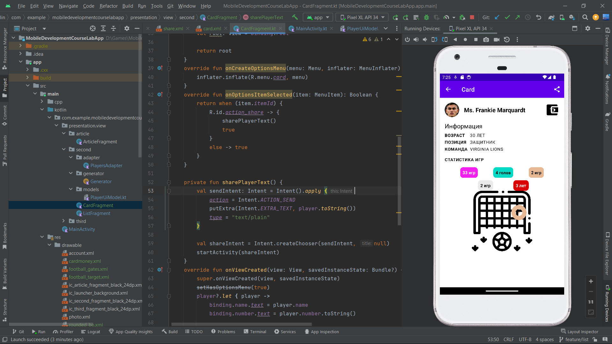
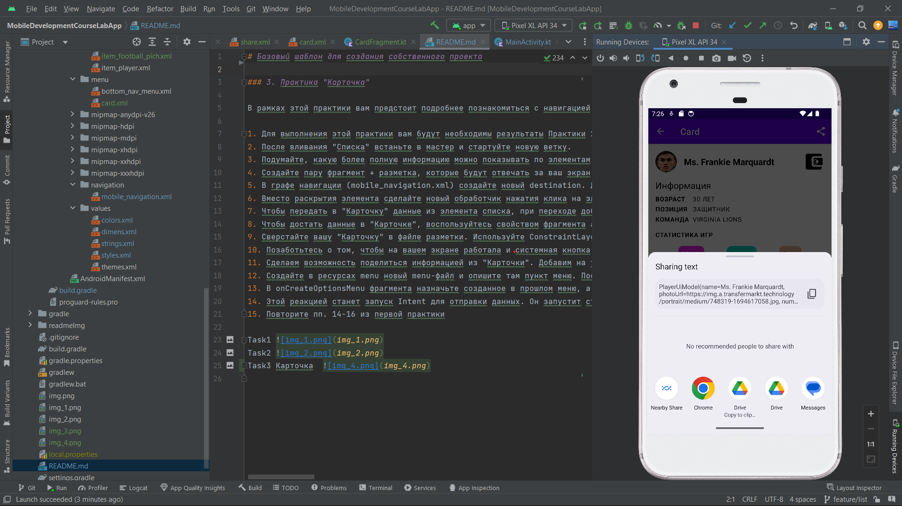

# Базовый шаблон для создания собственного проекта

### 3. Практика "Карточка"

В рамках этой практики вам предстоит подробнее познакомиться с навигацией и гибкими разметками при помощи ConstraintLayout, а также с некоторыми применениями Intent. 

1. Для выполнения этой практики вам будут необходимы результаты Практики 2 "Список". Выполните сначала ее. 
2. После вливания "Списка" встаньте в мастер и стартуйте новую ветку.
3. Подумайте, какую более полную информацию можно показывать по элементам вашего списка. Например, для списка рецептов это будет сам рецепт, для списка сотрудников - карточка сотрудника, для расписания занятий - информация о занятии. Именно переход на этот экран мы и будем делать.
4. Создайте пару фрагмент + разметка, которые будут отвечать за ваш экран.
5. В графе навигации (mobile_navigation.xml) создайте новый destination. Для фрагмента списка добавьте новый action, который позволяет сделать переход на этот новый экран.
6. Вместо раскрытия элемента сделайте новый обработчик нажатия клика на элемент списка. Теперь должен происходить переход по action из прошлого пункта. https://developer.android.com/guide/navigation/use-graph/navigate#id 
7. Чтобы передать в "Карточку" данные из элемента списка, при переходе добавьте данные в Bundle и приложите его (или с помощью аргументов навигации). Чтобы можно было передать модель данных целиком, сделайте ее Serializable. https://developer.android.com/guide/navigation/use-graph/pass-data#bundle
8. Чтобы достать данные в "Карточке", воспользуйтесь свойством фрагмента arguments. Теперь у вас есть данные, которыми вы заполните верстку. 
9. Сверстайте вашу "Карточку" в файле разметки. Используйте ConstraintLayout и его возможности: относительное позиционирование (startTo_start, topTo и тд), выравнивание и оступы, барьеры (barrier), цепочки (chain), смещения (bias) и т.д. То, что вам понадобится, зависит от вашей фантазии, но постарайтесь использовать большую часть из списка возможностей. 
10. Позаботьтесь о том, чтобы на вашем экране работала и системная кнопка "Назад", и стрелка в тулбаре. Кроме этого, на этом экране не нужен навбар с тремя основынми экранами. Это можно настроить в контейнере наших фрагментов - MainActivity.
11. Сделаем возможность поделиться информацией из "Карточки". Добавим на тулбар иконку "Поделиться". Делается это при помощи меню.
12. Создайте в ресурсах menu новый menu-файл и опишите там пункт меню. Поставьте ему иконку (share есть в стандартном наборе)
13. В onCreateOptionsMenu фрагмента назначьте созданное в прошлом меню, а в onOptionsItemSelected опишите реакцию на нажатие. 
14. Этой реакцией станет запуск Intent для отправки данных. Он запустит стандартный экран шеринга https://developer.android.com/training/sharing/send
15. Повторите пп. 14-16 из первой практики

Task3 Карточка  
      Карточка2 
