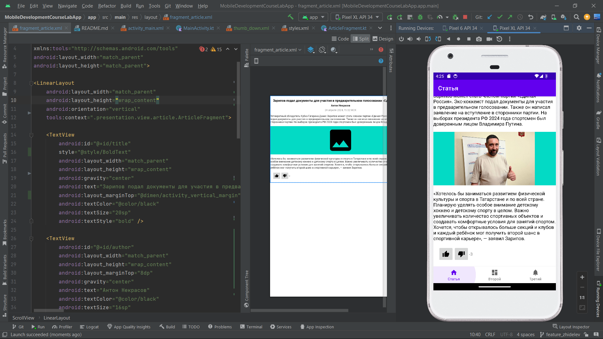

# Базовый шаблон для создания собственного проекта

### 1. Практика "Статья"

1. Откройте репозиторий https://github.com/Mobile-Development-Course-LAB-USUE/MobileDevelopmentCourseLabApp
Этот шаблон станет общим для ваших приложений. 
2. Сделайте fork этого репозитория в свой аккаунт.

3. Склонируйте репозиторий со своей страницы в Android Studio. 
4. Проверьте, что проект собирается - приложение с тремя вкладками запускается. 
5. Переключитьесь на новую ветку, назовите ее по задаче, например `feature/article`
6. Работайте с файлами ArticleFragment.kt и fragment_article.xml
7. Сверстайте разметку вашей будущей статьи в fragment_article.xml.
Она должна включать: заголовок, подзаголовок, основную часть статьи, одно или несколько изображений, кнопки лайк-дизлайк.
Вам пригодятся: ScrollView, LinearLayout, TextView, ImageView, ImageButton. Остановимся в рамках этой задачи на них. 
8. Строки можно не выносить - мы их используем однажды и когда-то переделаем. 
9. Выставьте отступы с помощью margin и padding (https://metanit.com/java/android/3.10.php). Выставьте размеры фото и кнопок. 
Значения повторяются? Время вынести их в dimen: https://metanit.com/java/android/2.6.php
10. Стили текстов можно описывать для каждого TextView. А нужно создать стили в styles.xml и навсегда забыть о заполнении 
кучи полей: https://devcolibri.com/unit/%D1%83%D1%80%D0%BE%D0%BA-4-%D1%80%D0%B0%D0%B1%D0%BE%D1%82%D0%B0-%D1%81-%D1%84%D0%B0%D0%B9%D0%BB%D0%BE%D0%BC-styles-xml-%D0%B7%D0%BD%D0%B0%D0%BA%D0%BE%D0%BC%D1%81%D1%82%D0%B2%D0%BE-%D1%81-textappeara-2/
11. Работа с разметкой закончена. Приступаем к логике в ArticleFragment.kt. 
12. Загрузим картинку. Испортируйте библиотеку Glide (https://github.com/bumptech/glide) и загрузите изображение
по ссылке. Делается это в классе фрагмента. 
13. Оживите кнопки лайка-дизлайка: определите слушателя для кнопок (https://startandroid.ru/ru/uroki/vse-uroki-spiskom/16-urok-9-obrabotchiki-sobytij-na-primere-button.html)
и обновляйте значение счетчика.
14. Порадуйтесь результату и запечатлите его в скриншоте. Добавьте его в README.md.
15. Закоммитьте изменения и отправьте в гитхаб. Там создайте пулл-реквест (внимание - в свой мастер, а не шаблона),
а ссылку на него приложите в ведомость. Преподаватель прижет и проверит вашу работу, оставит комментарии. Как только 
препод напишет "Ок, заливай" - заливайте ваш пулл-реквест в мастер. 
16. Обновите и переключитесь на мастер. Вы готовы к следующей задаче

### 2. Практика "Список"

Эта практика позволит вам работать со списочными представлениями, что позволяет не только делать сами списки, но и гибко управлять содержимым экрана. 

1. Выберите тему, элементы которой можно представить в виде списка. Это может быть список сотрудников, книга рецептов, афиша мероприятий. В дальнейших практиках мы научимся редактировать и добавлять записи в этот список.
2. Встаньте в ветку master, там уже должна быть Практика 1, и начните новую ветку. 
3. Переименуйте все, что связано с SecondFragment, в соответствии с темой. Например ListFragment
4. Начнем с того, из чего будет будет состоять список. Создайте разметку одного элемента в папке layout
5. В разметке бывшего SecondFragment создайте единственный виджет - RecyclerView. Не забудьте установить LayoutManager
6. Создайте класс - модель ваших данных, например Рецепт, Сотрудник и т.д.
7. Создайте источник данных, возвращающий список моделей из п. 6.
8. Создайте адаптер (Adapter), который будет отображать ваши данные из п.7 на элементах из п.4. Для этого:
9. Создайте ViewHolder - класс, который запомнит все, что нужно для обращения к элементу разметки, который и дается ему на вход. Достаточно привязять itemView к binding, и предоставлять последний.
10. Создайте в адаптере коллекцию, в которой будут храниться элементы.
11. Переопределите метод onCreateViewHolder так, чтобы он принимал элемент разметки и возвращал созданный в п.9 ViewHolder.
12. Теперь, если мы переопределим метод onBindViewHolder, мы можем взять элемент из коллекции (10) и холдер (9), и заполнить вьюшку из холдера данными из элемента коллекции. Здесь же можно навесить обработчики событий.
13. Сделайте в адаптере метод, который принимает коллекцию и говорит адаптеру обновиться с этими новыми данными (notifyDatasetChanged). Так мы и поставим данные в RecyclerView.
14. Создайте во Fragment экземпляр адаптера. Назначьте его RecyclerView и воспользуйтесь методом установки данных (13) с данными из источника (7). Теперь, когда мы запустим приложение, на втором фрагменте появится список!
15. Попробуйте сделать список интерактивным. Например, при нажатии на элемент будут показаны скрытые подробности. Изменить один элемент поможет notifyItemChanged
16. Повторите пп. 14-16 из прошлой практики

### 3. Практика "Карточка"

В рамках этой практики вам предстоит подробнее познакомиться с навигацией и гибкими разметками при помощи ConstraintLayout, а также с некоторыми применениями Intent. 

1. Для выполнения этой практики вам будут необходимы результаты Практики 2 "Список". Выполните сначала ее. 
2. После вливания "Списка" встаньте в мастер и стартуйте новую ветку.
3. Подумайте, какую более полную информацию можно показывать по элементам вашего списка. Например, для списка рецептов это будет сам рецепт, для списка сотрудников - карточка сотрудника, для расписания занятий - информация о занятии. Именно переход на этот экран мы и будем делать.
4. Создайте пару фрагмент + разметка, которые будут отвечать за ваш экран.
5. В графе навигации (mobile_navigation.xml) создайте новый destination. Для фрагмента списка добавьте новый action, который позволяет сделать переход на этот новый экран.
6. Вместо раскрытия элемента сделайте новый обработчик нажатия клика на элемент списка. Теперь должен происходить переход по action из прошлого пункта. https://developer.android.com/guide/navigation/use-graph/navigate#id 
7. Чтобы передать в "Карточку" данные из элемента списка, при переходе добавьте данные в Bundle и приложите его (или с помощью аргументов навигации). Чтобы можно было передать модель данных целиком, сделайте ее Serializable. https://developer.android.com/guide/navigation/use-graph/pass-data#bundle
8. Чтобы достать данные в "Карточке", воспользуйтесь свойством фрагмента arguments. Теперь у вас есть данные, которыми вы заполните верстку. 
9. Сверстайте вашу "Карточку" в файле разметки. Используйте ConstraintLayout и его возможности: относительное позиционирование (startTo_start, topTo и тд), выравнивание и оступы, барьеры (barrier), цепочки (chain), смещения (bias) и т.д. То, что вам понадобится, зависит от вашей фантазии, но постарайтесь использовать большую часть из списка возможностей. 
10. Позаботьтесь о том, чтобы на вашем экране работала и системная кнопка "Назад", и стрелка в тулбаре. Кроме этого, на этом экране не нужен навбар с тремя основынми экранами. Это можно настроить в контейнере наших фрагментов - MainActivity.
11. Сделаем возможность поделиться информацией из "Карточки". Добавим на тулбар иконку "Поделиться". Делается это при помощи меню.
12. Создайте в ресурсах menu новый menu-файл и опишите там пункт меню. Поставьте ему иконку (share есть в стандартном наборе)
13. В onCreateOptionsMenu фрагмента назначьте созданное в прошлом меню, а в onOptionsItemSelected опишите реакцию на нажатие. 
14. Этой реакцией станет запуск Intent для отправки данных. Он запустит стандартный экран шеринга https://developer.android.com/training/sharing/send
15. Повторите пп. 14-16 из первой практики

Task1 
